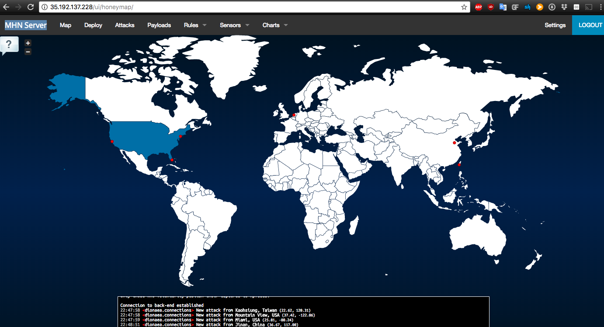
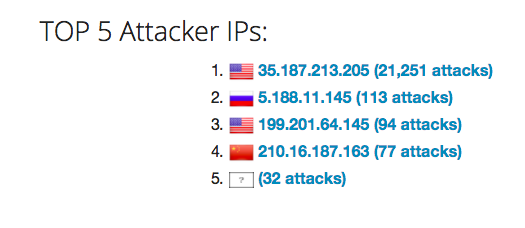
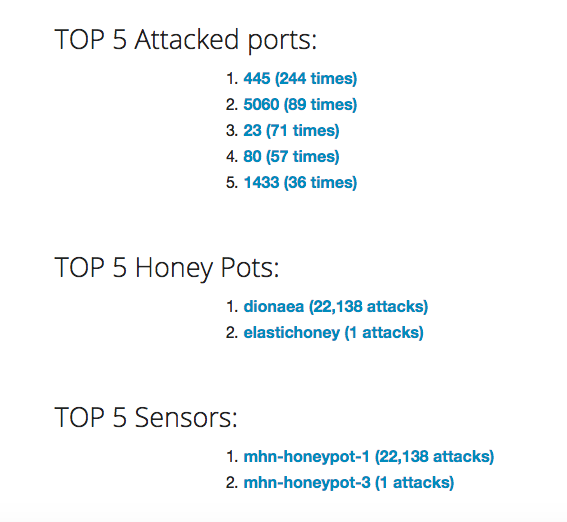

# honeypot
1) Dionaea with HTTP - Network Scanners - https://github.com/DinoTools/dionaea
2) ElasticHoney Sensor - Remote Code Execution in ES before 1.3.8 - https://github.com/threatstream/mhn/wiki/ElasticHoney-Sensor
3) Wordpot - Wordpress Attacks - https://github.com/threatstream/mhn/wiki/Wordpot-Sensor

Issues
-
It was unclear to me that I needed to open port 80, and trying to proceed with setup without it set caused my instances to beome un-toubleshoot-able. It was easiest to delete and start again fresh, with the following command
~~~
gcloud beta compute firewall-rules create mhn-allow-admin --direction=INGRESS --priority=1000 --network=default --action=ALLOW —rules=tcp:80,tcp:3000,tcp:10000 --source-ranges=0.0.0.0/0 --target-tags=mhn-admin
~~~

Summary
-

Looking up this IP with whois, my number 1 attacker actually seemed to be google

Although I did not have much time to gather data, my elastichoney was hit once, whereas the dinoeaa instance was hit 22,138 times. The

Raw Data
-
found at [session.json](./session.json)
